# SEC RAG - Evaluation-First RAG over JPMorgan 10-K Filings

A retrieval-augmented generation system for querying JPMorgan Chase's 10-K SEC filing, built around an explicit evaluation loop: every retrieval and prompting change is measured against a labeled question set with RAGAS before it ships. Built with LangGraph, Cohere reranking, ChromaDB, and Claude, and exposed as an MCP tool for agentic use.

**Live demo:** https://huggingface.co/spaces/rheaupadhyay/sec-rag

---

## Stack

- **LLM:** Claude (Anthropic)
- **Orchestration:** LangGraph - query rewriting, retrieval, generation, and validation nodes with conditional re-retrieval routing
- **Reranking:** Cohere
- **Vector store:** ChromaDB
- **Embeddings:** Sentence Transformers (HuggingFace)
- **Evaluation:** RAGAS over a labeled answerable/unanswerable set
- **Tool interface:** MCP (Model Context Protocol) - the query path is exposed as an MCP tool
- **Observability:** LangSmith tracing + custom per-node logging (latency, token cost, rerank scores)
- **CI:** GitHub Actions - evaluation gate on Faithfulness
- **Frontend:** Streamlit
- **Deployment:** HuggingFace Spaces (Docker)

---

## Architecture



The pipeline is a LangGraph DAG. A query first passes through a **rewriting** node, then **retrieval** (ChromaDB) and **Cohere reranking**, then **generation** with Claude. A **validation** node scores how grounded the generated answer is in the retrieved chunks (0–1); if the score falls below 0.7 and retries remain (≤3), the graph routes back to retrieval, otherwise it terminates. The query path is also surfaced as an **MCP tool** so the system can be called as a tool inside an agentic workflow.

---

## MCP tool

The retrieval-and-answer path is exposed over the Model Context Protocol, so an external agent can call SEC RAG as a tool rather than embedding the pipeline directly. This keeps the RAG system as a self-contained, independently evaluable capability that an orchestrating agent can invoke alongside other tools.

---

## Evaluation

Evaluated with RAGAS on 10 questions: 5 answerable from the indexed excerpt, 5 outside it. Each phase isolates one change so its effect on the metrics is attributable.

> **Reading the metrics:** Answer Relevancy is 0.0 for unanswerable questions *by design* - the model correctly responds "I don't have that information," which RAGAS scores as irrelevant. This drags the overall average down regardless of retrieval quality, so answerable-subset numbers are the meaningful signal for retrieval changes.

### Phase 1 — No query rewriting, no reranking

| Metric | Answerable | Unanswerable |
|--------|-----------|--------------|
| Faithfulness | 1.000 | 0.893 |
| Answer Relevancy | 0.765 | 0.000 |
| Context Precision | 0.500 | 0.628 |
| Context Recall | 0.800 | 0.800 |

**Findings**

- **Faithfulness (0.893 unanswerable):** The fallback instruction works, but the model occasionally adds unsupported suggestions (e.g. "refer to capital management section") that aren't in the retrieved context — a genuine faithfulness failure. Fix: stricter fallback instruction.
- **Answer Relevancy (0.0 unanswerable):** Some fallback answers reference what *is* in the document rather than addressing the question. Known RAGAS limitation on fallback responses, not a model failure.
- **Context Precision (0.50 answerable):** Retrieved chunks carry significant irrelevant content. 500-token chunks are likely too large, so relevant information shares a chunk with noise.
- **Context Recall (segments question):** Retrieval failure on an answerable question — segment information exists in the indexed data but the wrong chunks were returned, likely because chunking split the segment description across boundaries.

### Phase 2 - LangGraph query rewriter, no reranking

| Metric | Answerable | Unanswerable | Overall |
|---|---|---|----|
| Faithfulness | 0.800 | 0.920 | 0.860 |
| Answer Relevancy | 0.771 | 0.000 | 0.385 |
| Context Precision | 0.533 | 0.500 | 0.517 |
| Context Recall | 0.800 | 0.800 | 0.800 |

**Per-question breakdown**

| Question | Faithfulness | Answer Relevancy | Context Precision | Context Recall | Answerable |
|---|---|---|---|---|---|
| Where is JPMorgan Chase headquartered? | 1.00 | 0.986 | 1.000 | 1.0 | Yes |
| What is JPMorgan Chase's ticker symbol and on which exchange does it trade? | 0.50 | 0.940 | 0.333 | 1.0 | Yes |
| What are JPMorgan Chase's three reportable business segments? | 0.50 | 0.000 | 0.000 | 0.0 | Yes |
| How many employees does JPMorgan Chase have globally? | 1.00 | 0.927 | 1.000 | 1.0 | Yes |
| What were JPMorgan Chase's total assets as of December 31, 2025? | 1.00 | 1.000 | 0.333 | 1.0 | Yes |
| What is JPMorgan Chase's net interest income for 2025? | 1.00 | 0.000 | 0.639 | 1.0 | No |
| What is JPMorgan Chase's CET1 capital ratio? | 1.00 | 0.000 | 0.806 | 1.0 | No |
| Who is the CEO of JPMorgan Chase? | 1.00 | 0.000 | 0.000 | 0.0 | No |
| What is JPMorgan Chase's total revenue for 2025? | 1.00 | 0.000 | 0.417 | 1.0 | No |
| What is JPMorgan Chase's return on equity? | 0.60 | 0.000 | 0.639 | 1.0 | No |

### Phase 3 - Query rewriter + Cohere reranking

| Metric | Before | After | Change |
|---|---|---|---|
| Faithfulness | 0.860 | 0.930 | +0.070 |
| Answer Relevancy | 0.385 | 0.387 | ~flat |
| Context Precision | 0.517 | 0.642 | +0.125 |
| Context Recall | 0.800 | 0.800 | flat |

Reranking improved context precision (+0.125) and faithfulness (+0.070): the chunks passed to Claude became more relevant and answers stayed closer to the source. Context recall was unaffected - reranking reorders existing chunks but retrieves no new ones, so coverage is unchanged. Answer relevancy stayed flat (answerable: 0.771 to 0.773); the unanswerable questions continue to score 0 by design.

The business-segments question still fails on both context precision and recall — likely a document-coverage issue (the content may not be in the indexed excerpt) rather than a retrieval issue. Still to test: varying chunk size and overlap.

| Answerable | Faithfulness | Answer Relevancy | Context Precision | Context Recall |
|---|---|---|---|---|
| Yes | 0.900 | 0.773 | 0.700 | 0.800 |
| No | 0.960 | 0.000 | 0.583 | 0.800 |

### Phase 4 - Chunk-size experiment

| Metric | Baseline (500/50) | 256/26 | 512/51 | 1024/102 |
|---|---|---|---|---|
| Faithfulness | 0.930 | 0.982 | 0.955 | 1.000 |
| Answer Relevancy | 0.387 | 0.490 | 0.385 | 0.434 |
| Context Precision | 0.642 | 0.850 | 0.700 | 0.850 |
| Context Recall | 0.800 | 0.900 | 0.800 | 0.900 |

**Chunk-size tradeoffs**

- **Small (256):** precise retrieval, but more chunks reach the LLM, raising lost-in-the-middle risk.
- **Medium (512):** worst of both here — splits content across boundaries and loses needed overlap.
- **Large (1024):** less precise retrieval but richer context per chunk, which raises faithfulness.

> **Final config: 1024/102** — prioritizing faithfulness, the critical metric for a SEC-filing assistant.

### Phase 5 - Validator node with conditional re-retrieval

Added a validator node (Claude) that scores how grounded the answer is in the retrieved chunks (0–1). If the score is below 0.7 and retries ≤ 3, the graph routes back to retrieval; otherwise it terminates. This matters because a hallucinated figure in a financial-filing assistant has real consequences — the validator catches unsupported answers before they reach the user.

| Metric | Phase 4 | Phase 5 | Change |
|--------|---------|---------|--------|
| Faithfulness | 1.000 | 0.980 | −0.020 |
| Answer Relevancy | 0.434 | 0.489 | +0.055 |
| Context Precision | 0.850 | 0.889 | +0.039 |
| Context Recall | 0.900 | 0.900 | flat |

The small faithfulness dip is within run-to-run variance, not a regression. Answer relevancy and context precision both improved.

---

## Semantic cache - evaluation finding (not a shipped optimization)

I prototyped a semantic cache over final answers (brute-force cosine similarity against an in-memory store, serving a cached answer when max similarity ≥ threshold) and, rather than assume it worked, built an **LLM-judge harness** over a labeled calibration set of query pairs to test whether cache "hits" are actually *answer-equivalent*.

**The finding:** embedding similarity captures **topical overlap, not answer-equivalence.** Across every embedding model tested, a directional entity-role swap (a pair with the same entities but a reversed relationship, and therefore a *different* correct answer) ranked as the *most* similar pair, while the hardest genuine paraphrase ranked *least* similar. A similarity-only cache would therefore serve confidently wrong answers on exactly the pairs it's most sure about.

At the calibration threshold, the gate admitted essentially no true-paraphrase pairs, so the naive cost/latency case for the cache does not hold on this corpus. The cache is retained here as an evaluation study - a demonstration that a plausible optimization has to be validated before it's trusted — not as a claimed performance win.

---

## CI/CD & observability

- **GitHub Actions gate:** the RAGAS evaluation runs in CI and gates on Faithfulness (≥0.85) across the answerable subset, so a retrieval or prompt change that regresses grounding blocks the PR.
- **LangSmith tracing:** every node is traced, with custom logging of latency, token cost, and Cohere rerank scores for per-node profiling and debugging.

---

## Setup

```bash
git clone https://huggingface.co/spaces/rheaupadhyay/sec-rag
cd sec-rag
python -m venv venv && source venv/bin/activate
pip install -r requirements.txt
export ANTHROPIC_API_KEY=your_key
export COHERE_API_KEY=your_key
streamlit run app.py
```

---

## Environment

- Python 3.11 (via Dockerfile — `runtime.txt` is ignored by HF Spaces)
- Secrets: `ANTHROPIC_API_KEY`, `COHERE_API_KEY` set as HF Space secrets
- Vector store builds at runtime - `chroma_db/` is not committed

---

## Known limitations

- RAGAS scores have run-to-run variance due to LLM-based evaluation.
- Unanswerable ground truths artificially suppress recall and pull the overall averages down; answerable-subset numbers are the meaningful signal.
- The indexed excerpt is ~100KB - financial statements (revenue, capital ratios, income) are truncated out and not evaluable from this dataset.
- The business-segments question fails on both precision and recall, likely a document-coverage issue rather than a retrieval one.
